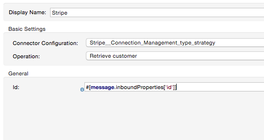
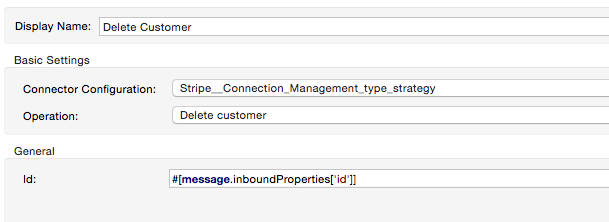

[[installation-and-usage]]
Installation and Usage
~~~~~~~~~~~~~~~~~~~~~~

link:#purpose[Purpose]

link:#prerequisites[Prerequisites]

link:#getting-anypoint-studio-ready[Getting Anypoint Studio Ready]

link:#setting-up-the-project[Setting up the project]

link:#building-the-flows[Building the flows, Demo]

link:#other-resources[Other resources]

[[purpose]]
Purpose
^^^^^^^

This document provides detailed instructions on how to install WhiteSky
Labs' Stripe Connector for the AnyPoint Platform, and demonstrates how
to build and run a simple demo application with AnyPoint Studio which
creates a Customer, retrieves it, and then deletes it.

[[prerequisites]]
Prerequisites
^^^^^^^^^^^^^

In order to build and run this project you'll need:

* An account with Stripe. Set it up
https://dashboard.stripe.com/register[here].
* http://www.mulesoft.org/download-mule-esb-community-edition[MuleSoft
Anypoint Studio Community Edition].

[[getting-anypoint-studio-ready]]
Getting Anypoint Studio Ready
^^^^^^^^^^^^^^^^^^^^^^^^^^^^^

If you haven't installed Anypoint Studio on your computer yet, it's time
to download Anypoint Studio from this location:
http://www.mulesoft.org/download-mule-esb-community-edition. You also
have the option of downloading a 30 day trial of Mule Enterprise Edition
from this location http://www.mulesoft.com/mule-esb-enterprise if you
want to evaluate and purchase the premium edition. This demo can be
built using either community or enterprise edition. There is no specific
installation that you need to run. Once you unzip the zip file to your
desired location, you are ready to go. To install the Stripe connector,
you can download and install it from Anypoint Connectors Update Site. To
do that:

1.  Open Anypoint Studio and from "Help" menu select "Install New
Software...". Installation dialog box opens - Figure below.
2.  From "Work with" drop down, select "Anypoint Connectors Update
Site". The list of available connectors will be shown to you.
3.  Find and select the Stripe connector in the list of available
connectors, the tree structure that is shown. A faster way to find a
specific connector is to filter the list by typing the name of the
connector in the input box above the list. You can choose more than one
connector to be installed at once.
4.  When you are done selecting the connectors to be installed, click on
"Next" button. Details of each connector are shown on the next page.
Click on "Next" button again and accept the terms of the license
agreement.
5.  Click on "Finish" button. The connector is downloaded and installed
onto Studio. You'll need to restart the Studio for the installation to
be completed.

[[setting-up-the-project]]
Setting up the project
^^^^^^^^^^^^^^^^^^^^^^

Now that you've got your Anypoint Studio up and running, it's time to
work on the Application. Create a new Mule Project by clicking on "File
> New > Mule Project". In the new project dialog box, the only thing you
are required to enter is the name of the project. You can click on
"Next" to go through the rest of pages.

The first thing to do in your new app is to configure the connection to
Stripe. In the message flow editor, click on the "Global Elements" tab
on the bottom of the page. Then click on "Create" button on the top
right of the tab. In the "Choose Global Element" type dialog box that
opens select "Stripe" under "Connector Configuration" and click okay.

In the Stripe Configuration box that follows, set the API Key to your
Test or Live API Key. You can also set the API Version, which is not
recommended.

image:images/setstripeprops.png[Set Stripe Properties]

The XML for the global element should look like this:

--------------------------------------------------------------------------------------------------------------------------------------------------------
 <stripe:config-type name="Stripe__Connection_Management_type_strategy" apiKey="<YOUR_API_KEY>" doc:name="Stripe: Connection Management type strategy"/>
--------------------------------------------------------------------------------------------------------------------------------------------------------

[[building-the-flows-demo]]
Building the flows, Demo
^^^^^^^^^^^^^^^^^^^^^^^^

It's time to build the flows which creates a Customer, retrieves them,
and deletes the Customer.

image:images/createcustomer.png[Create Customer flow]

image:images/retrieveandremovecustomer.png[Retrieve and Delete flows]

*Create Customer flow:* This is the flow which creates a Customer in
Stripe. Start by dragging an HTTP endpoint from the palette onto the
flow. Create a new Connector Configuration for this endpoint and accept
the defaults.

image:images/httpconnectorconfiguration.png[HTTP Connector
Configuration]

Now add a path to your HTTP receiver: "/createcustomer". This is the URL
you will call to start the flow.

image:images/httpreceiverconfiguration.png[HTTP Receiver Configuration]

Then drag a Stripe Connector onto the flow after the HTTP endpoint. In
the configuration window for the Stripe Connector, select the previously
created Stripe config from the Config Reference dropdown. Set the
Operation to "Create Customer", and provide an email and description.
Add an "Object to JSON" transformer at the end to make sure the response
is readable by a human. Click okay.

This completes the Create Customer flow.

*Retrieve Customer flow:* This is the flow which retrieves the Customer.
Start by dragging an HTTP endpoint from the palette onto the workspace
(not onto a flow), creating a new flow. Use the existing HTTP
configuration. Configure the Path to "/retrieveCustomer". This is the
URL you will call to start the flow. Then drag a Stripe Connector onto
the flow after the HTTP endpoint. In the configuration window for the
Stripe Connector, select the previously created Stripe config from the
Config Reference dropdown. Set the Operation to "Retrieve Customer", and
set the id field to
"#[message.inboundProperties.'http.query.params'.id]". Add an "Object to
JSON" transformer at the end to make sure the response is readable by a
human. Click OK.

*Delete Customer Flow:* This is the flow which removes the customer you
created. Start by dragging an HTTP endpoint from the palette onto the
workspace (not onto a flow), creating a new flow. Use the existing HTTP
configuration. Configure the Path to "/deleteCustomer". This is the URL
you will call to start the flow. Then drag a Stripe Connector onto the
flow after the HTTP endpoint. In the configuration window for the Stripe
Connector, select the previously created Stripe config from the Config
Reference dropdown. Set the Operation to "Delete Customer", and set the
id field to "#[message.inboundProperties.'http.query.params'.id]". Add
an "Object to JSON" transformer at the end to make sure the response is
readable by a human. Click OK.

*Flow XML*

The final flow XML should look like this.

--------------------------------------
<?xml version="1.0" encoding="UTF-8"?>
--------------------------------------

 " doc:name="Stripe: Connection Management type strategy"/>

*Testing the app*

Now it's time to test the app. Run the app in Anypoint Studio and open a
browser window. Visit http://localhost:8081/createcustomer. This will
create a Customer in Stripe and return the ID in the JSON. Now visit
http://localhost:8081/retrievecustomer?id=<ID%20RETRIEVED%20FROM%20CREATE%20CALL>[http://localhost:8081/retrievecustomer?id=].
This will retrieve the customer, confirming it exists. Now visit
http://localhost:8081/deletecustomer?id=<ID%20RETRIEVED%20FROM%20CREATE%20CALL>[http://localhost:8081/deletecustomer?id=].
This will remove the previously created customer.

[[other-resources]]
Other resources
^^^^^^^^^^^^^^^

For more information on:

● MuleSoft platform and how to build Mule apps, please visit
http://www.mulesoft.org/documentation/display/current/Home[http://www.mulesoft.org/documentation]
