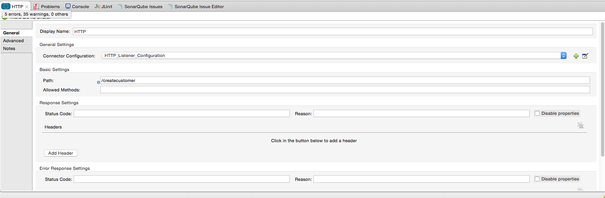

Installation and Usage
----------------------

[Purpose](#purpose)

[Prerequisites](#prerequisites)

[Getting Anypoint Studio Ready](#getting-anypoint-studio-ready)

[Setting up the project](#setting-up-the-project)

[Building the flows, Demo](#building-the-flows)

[Other resources](#other-resources)

### Purpose

This document provides detailed instructions on how to install WhiteSky Labs' Stripe Connector for the AnyPoint Platform, and demonstrates how to build and run a simple demo application with AnyPoint Studio which creates a Customer, retrieves it, and then deletes it. 

### Prerequisites

In order to build and run this project you'll need:

* An account with Stripe. Set it up [here](https://dashboard.stripe.com/register).

* [MuleSoft Anypoint Studio Community Edition](http://www.mulesoft.org/download-mule-esb-community-edition).

###Getting Anypoint Studio Ready

If you haven't installed Anypoint Studio on your computer yet, it's time to download Anypoint Studio from this location: [http://www.mulesoft.org/download-mule-esb-community-edition](http://www.mulesoft.org/download-mule-esb-community-edition). You also have the option of downloading a 30 day trial of Mule Enterprise Edition from this location [http://www.mulesoft.com/mule-esb-enterprise](http://www.mulesoft.com/mule-esb-enterprise) if you want to evaluate and purchase the premium edition. This demo can be built using either community or enterprise edition. There is no specific installation that you need to run. Once you unzip the zip file to your desired location, you are ready to go. To install the Stripe connector, you can download and install it from Anypoint Connectors Update Site. To do that:

1. Open Anypoint Studio and from "Help" menu select "Install New Software...". Installation dialog box opens - Figure below.

2. From "Work with" drop down, select "Anypoint Connectors Update Site". The list of available connectors will be shown to you.

3. Find and select the Stripe connector in the list of available connectors, the tree structure that is shown. A faster way to find a specific connector is to filter the list by typing the name of the connector in the input box above the list. You can choose more than one connector to be installed at once.

4. When you are done selecting the connectors to be installed, click on "Next" button. Details of each connector are shown on the next page. Click on "Next" button again and accept the terms of the license agreement.

5. Click on "Finish" button. The connector is downloaded and installed onto Studio. You'll need to restart the Studio for the installation to be completed.

###Setting up the project

Now that you've got your Anypoint Studio up and running, it's time to work on the Application. Create a new Mule Project by clicking on "File \> New \> Mule Project". In the new project dialog box, the only thing you are required to enter is the name of the project. You can click on "Next" to go through the rest of pages.

The first thing to do in your new app is to configure the connection to Stripe. In the message flow editor, click on the "Global Elements" tab on the bottom of the page. Then click on "Create" button on the top right of the tab. In the "Choose Global Element" type dialog box that opens select "Stripe" under "Connector Configuration" and click okay.

In the Stripe Configuration box that follows, set the API Key to your Test or Live API Key. You can also set the API Version, which is not recommended.

The XML for the global element should look like this:

     <stripe:config-type name="Stripe__Connection_Management_type_strategy" apiKey="<YOUR_API_KEY>" doc:name="Stripe: Connection Management type strategy"/>

###Building the flows, Demo 
It's time to build the flows which creates a Customer, retrieves them, and deletes the Customer.

**Create Customer flow:** This is the flow which creates a Customer in Stripe. Start by dragging an HTTP endpoint from the palette onto the flow. Create a new Connector Configuration for this endpoint and accept the defaults. 

Now add a path to your HTTP receiver: "/createcustomer". This is the URL you will call to start the flow.

Then drag a Stripe Connector onto the flow after the HTTP endpoint. In the configuration window for the Stripe Connector, select the previously created Stripe config from the Config Reference dropdown. Set the Operation to "Create Customer", and provide an email and description. Add an "Object to JSON" transformer at the end to make sure the response is readable by a human. Click okay.

This completes the Create Customer flow.

**Retrieve Customer flow:** This is the flow which retrieves the Customer. Start by dragging an HTTP endpoint from the palette onto the workspace (not onto a flow), creating a new flow. Use the existing HTTP configuration. Configure the Path to "/retrieveCustomer". This is the URL you will call to start the flow.
Then drag a Stripe Connector onto the flow after the HTTP endpoint. In the configuration window for the Stripe Connector, select the previously created Stripe config from the Config Reference dropdown. Set the Operation to "Retrieve Customer", and set the id field to "#[message.inboundProperties.'http.query.params'.id]". Add an "Object to JSON" transformer at the end to make sure the response is readable by a human. Click OK.

**Delete Customer Flow:** This is the flow which removes the customer you created. Start by dragging an HTTP endpoint from the palette onto the workspace (not onto a flow), creating a new flow. Use the existing HTTP configuration. Configure the Path to "/deleteCustomer". This is the URL you will call to start the flow.
Then drag a Stripe Connector onto the flow after the HTTP endpoint. In the configuration window for the Stripe Connector, select the previously created Stripe config from the Config Reference dropdown. Set the Operation to "Delete Customer", and set the id field to "#[message.inboundProperties.'http.query.params'.id]". Add an "Object to JSON" transformer at the end to make sure the response is readable by a human. Click OK.

**Flow XML**

The final flow XML should look like this.

	<?xml version="1.0" encoding="UTF-8"?>

<mule xmlns:json="http://www.mulesoft.org/schema/mule/json" xmlns:http="http://www.mulesoft.org/schema/mule/http" xmlns:tracking="http://www.mulesoft.org/schema/mule/ee/tracking" xmlns:stripe="http://www.mulesoft.org/schema/mule/stripe" xmlns="http://www.mulesoft.org/schema/mule/core" xmlns:doc="http://www.mulesoft.org/schema/mule/documentation"
	xmlns:spring="http://www.springframework.org/schema/beans" version="EE-3.6.0"
	xmlns:xsi="http://www.w3.org/2001/XMLSchema-instance"
	xsi:schemaLocation="http://www.springframework.org/schema/beans http://www.springframework.org/schema/beans/spring-beans-current.xsd
http://www.mulesoft.org/schema/mule/core http://www.mulesoft.org/schema/mule/core/current/mule.xsd
http://www.mulesoft.org/schema/mule/stripe http://www.mulesoft.org/schema/mule/stripe/current/mule-stripe.xsd
http://www.mulesoft.org/schema/mule/http http://www.mulesoft.org/schema/mule/http/current/mule-http.xsd
http://www.mulesoft.org/schema/mule/ee/tracking http://www.mulesoft.org/schema/mule/ee/tracking/current/mule-tracking-ee.xsd
http://www.mulesoft.org/schema/mule/json http://www.mulesoft.org/schema/mule/json/current/mule-json.xsd">
    <stripe:config-type name="Stripe__Connection_Management_type_strategy" apiKey="<YOUR_API_KEY>" doc:name="Stripe: Connection Management type strategy"/>
    <http:listener-config name="HTTP_Listener_Configuration" host="0.0.0.0" port="8081" doc:name="HTTP Listener Configuration"/>
    <flow name="stripe-createCustomerFlow">
        <http:listener config-ref="HTTP_Listener_Configuration" path="/createcustomer" doc:name="HTTP"/>
        <stripe:create-customer config-ref="Stripe__Connection_Management_type_strategy" description="Test Customer" email="demo@demo.com" doc:name="CreateCustomer"/>
        <json:object-to-json-transformer doc:name="Object to JSON"/>
    </flow>
    <flow name="stripe-retrieveCustomerFlow">
        <http:listener config-ref="HTTP_Listener_Configuration" path="/retrievecustomer" doc:name="HTTP"/>
        <stripe:retrieve-customer config-ref="Stripe__Connection_Management_type_strategy" id="#[message.inboundProperties.'http.query.params'.id]" doc:name="RetrieveCustomer"/>
        <json:object-to-json-transformer doc:name="Object to JSON"/>
    </flow>
    <flow name="stripe-deleteCustomerFlow">
        <http:listener config-ref="HTTP_Listener_Configuration" path="/deletecustomer" doc:name="HTTP"/>
        <stripe:delete-customer config-ref="Stripe__Connection_Management_type_strategy" id="#[message.inboundProperties.'http.query.params'.id]" doc:name="Delete Customer"/>
        <json:object-to-json-transformer doc:name="Object to JSON"/>
    </flow>
</mule>

**Testing the app**

Now it's time to test the app. Run the app in Anypoint Studio and open a browser window. Visit [http://localhost:8081/createcustomer](http://localhost:8081/createcustomer). This will create a Customer in Stripe and return the ID in the JSON.
Now visit [http://localhost:8081/retrievecustomer?id=<ID RETRIEVED FROM CREATE CALL>](http://localhost:8081/retrievecustomer?id=<ID RETRIEVED FROM CREATE CALL>). This will retrieve the customer, confirming it exists.
Now visit [http://localhost:8081/deletecustomer?id=<ID RETRIEVED FROM CREATE CALL>](http://localhost:8081/deletecustomer?id=<ID RETRIEVED FROM CREATE CALL>). This will remove the previously created customer.

###Other resources

For more information on:

●     MuleSoft platform and how to build Mule apps, please visit  [http://www.mulesoft.org/documentation](http://www.mulesoft.org/documentation/display/current/Home)